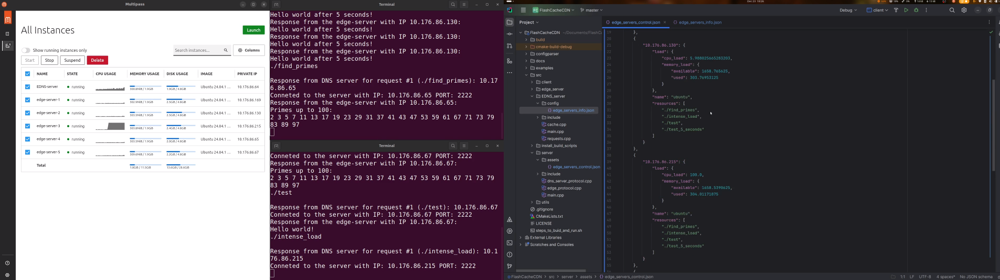
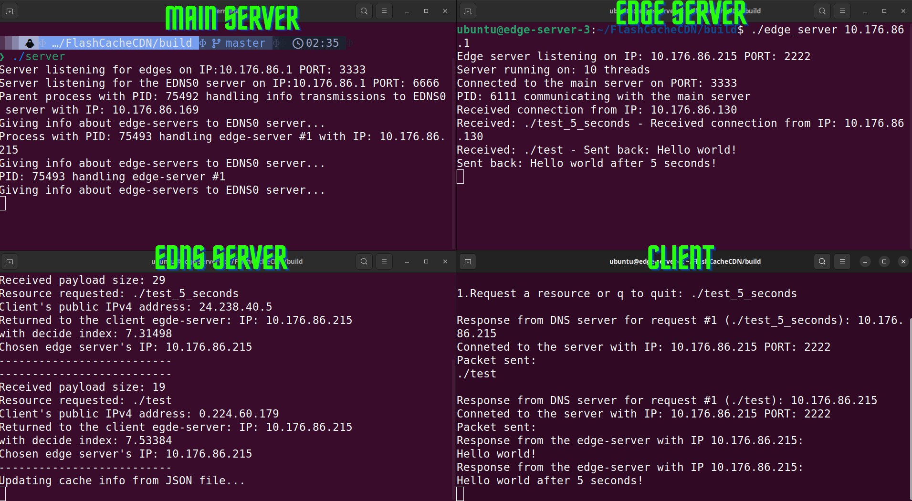

# FlashCacheCDN

## Overview
FlashCacheCDN is a Content Delivery Network (CDN) designed to optimize data delivery speed, reduce latency, and enhance user experience. By distributing nodes across various geographical locations, mySCDN ensures optimal resource allocation, minimal costs, and high service quality.

## Applied Technologies
- **Transport Protocol**: TCP to ensure reliable packet transmission, even for EDNS0 server that uses more complex derivation of DNS protocol.
- **Data Formats**: JSON for cache information, .ini for configuration files.
- **Platform**: Unix-based systems with standard C/C++ libraries.
- **Concurrency**: Utilizes multithreading, multiprocessing, and multiplexing with libraries like `<thread>` in C++ and `<unistd.h>` in C.
- **Build Tools**: CMake and bash scripts for builds and dependency management.

## Objectives
- Enhance customer experience by minimizing latency.
- Dynamically allocate the most convenient node for each client.
- Maintain service continuity with backup nodes in case of failures.
- Implement concurrency management to optimize CPU usage.
- Gradually improve caching and resource utilization.
- Effectively handle errors and unforeseen scenarios.


## Application Structure
The architecture includes four main entities:
1. **Main Server**: Stores original resources, updates edge servers, and monitors cache and load.
2. **Edge Servers**: Cache resources and report load to the main server.
3. **EDNS Server**: Acts as a load balancer, mapping edge servers based on cache, load, and location.
4. **Client**: Requests resources through the EDNS server and connects to the allocated edge server.

## Implementation Details
- **Concurrency Management**: Thread pools in edge servers, multiplexing in the EDNS server, and pre-forking in the main server with the number of processes = edge servers. 
- **Protocols**: At the Application layer (over TCP at transport layer): custom protocols for communication between clients, edge servers,  and the main server using JSON and efficient packet structures.

## Potential Improvements
- Anti-DoS/DDoS protection with rate limiting.
- Enhanced caching algorithms (e.g., LFU, LRU) on edge servers.
- Caching mechanisms for lookups on the EDNS server.
- Secure communication via TLS.


## Steps to Build and Run the Application

Refer to the `steps_to_build_and_run.sh` script for detailed instructions on setting up and running the application.

```bash
# Clone the FlashCacheCDN repository
git clone https://github.com/iancustefan26/FlashCacheCDN.git

# Change into the repository directory
cd FlashCacheCDN

# Make the steps_to_build_and_run.sh script executable
chmod u+x steps_to_build_and_run.sh

# Run the setup script
./steps_to_build_and_run.sh

```
## Visual Demonstrations

### Concurrent Requests Handling

**Description**: This image demonstrates the system's capability to handle multiple concurrent requests efficiently, running 5 instances of edges

### Load Handling

**Description**: This image provides proof of the system's updates during load balancing.
### System Running Status

**Description**: This image captures the system in a running state, showing real-time data flow and server interactions.

### Presentation Video

**Description**: A comprehensive video presentation explaining the project's architecture, features, and benefits, along with a demonstration of the system in action.

## Real-world Use Case
An aviation company uses FlashCacheCDN to distribute its online booking service globally, improving load times and increasing profitability by deploying edge servers in strategic locations so UX will be better by getting better response times from the website.

## References
- [Content Delivery Network CDN](https://en.wikipedia.org/wiki/Content_delivery_network)
- [Multithreading in Computer Architecture](https://en.wikipedia.org/wiki/Multithreading_(computer_architecture))
- [C++ Standard Library Reference](https://en.cppreference.com/)

For more detailed information, refer to the `docs_EN.pdf` documentation included in the repository.

## License
This project is licensed under the MIT License. See the LICENSE file for details.
